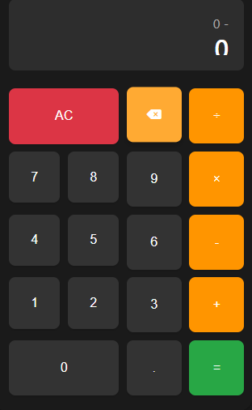

# Modern Calculator

A sleek, responsive calculator built with HTML, CSS, and JavaScript. This calculator includes all basic arithmetic operations and features a clean, modern interface with light/dark mode support.



## Features

- ➕➖✖️➗ Basic arithmetic operations (+, -, ×, ÷)
- 🎨 Light/Dark theme toggle
- ⌨️ Full keyboard support
- 📱 Fully responsive design
- 🎯 Real-time calculation
- 🧹 Clear and delete functionality
- 💾 Theme preference saved in local storage
- 🔄 Smooth animations and transitions

## Getting Started

### Prerequisites
- A modern web browser (Chrome, Firefox, Safari, Edge)
- No server required - runs directly in the browser

### Installation

1. Clone the repository or download the source code
   ```bash
   git clone https://github.com/yourusername/calculator.git
   ```

2. Navigate to the project directory
   ```bash
   cd calculator
   ```

3. Open `index.html` in your preferred web browser
   ```bash
   start index.html  # On Windows
   open index.html   # On macOS
   xdg-open index.html  # On Linux
   ```

## Usage

### Basic Operations
- Click the number buttons or use your keyboard to input numbers
- Use the operation buttons (+, -, ×, ÷) to perform calculations
- Press `=` or hit Enter to see the result
- Press `AC` or Escape to clear everything
- Press `⌫` or Backspace to delete the last digit

### Keyboard Shortcuts
- `0-9` - Input numbers
- `.` - Decimal point
- `+`, `-`, `*`, `/` - Basic operations
- `=` or `Enter` - Calculate result
- `Backspace` - Delete last digit
- `Escape` - Clear all
- `T` - Toggle theme (when focused on calculator)

### Theme Toggle
Click the sun/moon icon in the top-right corner to switch between light and dark themes. Your preference will be saved for future visits.

## Browser Support

The calculator works on all modern browsers including:
- Google Chrome (latest)
- Mozilla Firefox (latest)
- Safari (latest)
- Microsoft Edge (latest)
- Opera (latest)

## File Structure

```
calculator/
├── index.html         # Main HTML file
├── styles.css         # Styles and theming
├── script.js          # Calculator logic
└── README.md          # This file
```

## Customization

### Changing Colors
You can customize the color scheme by modifying the CSS variables in the `:root` and `[data-theme="light"]` selectors in `styles.css`.

### Adding New Features
1. Add new buttons to `index.html`
2. Style them in `styles.css`
3. Add the corresponding functionality in `script.js`

## Contributing

Contributions are welcome! Please feel free to submit a Pull Request.

1. Fork the project
2. Create your feature branch (`git checkout -b feature/AmazingFeature`)
3. Commit your changes (`git commit -m 'Add some AmazingFeature'`)
4. Push to the branch (`git push origin feature/AmazingFeature`)
5. Open a Pull Request

## License

This project is open source and available under the [MIT License](LICENSE).

## Acknowledgments

- [Font Awesome](https://fontawesome.com/) for the icons
- Inspired by modern calculator designs

---

Built with ❤️ by ABDUL SABOOR
